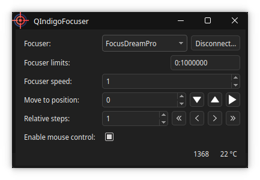
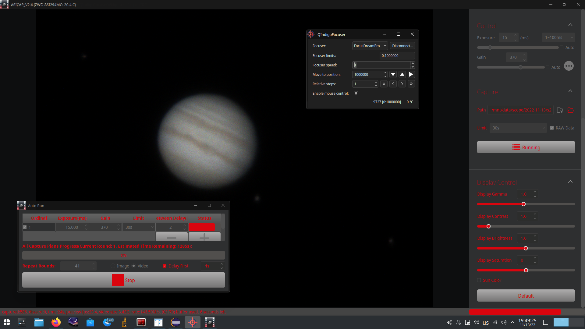
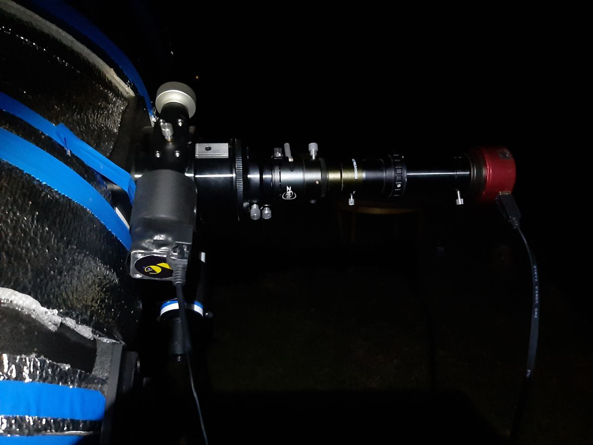

# QIndigoFocuser
Qt-based INDIGO client application for AstroGadget FocusDreamPro focuser driver.

The motivation is that my currently favorite planetary imager ZWO ASICap has no builtin support for my focuser,
 so I built this simple standalone app based on FocusDreamPro driver provided by INDIGO astronomy project.

INDIGO astronomy site:

[https://www.indigo-astronomy.org](https://www.indigo-astronomy.org)

AstroGadget FocusDreamPro site:

[https://astro-gadget.net/gadgets/control-of-focusers/focusdreampro-dualspeedscrayford-kit](https://astro-gadget.net/gadgets/control-of-focusers/focusdreampro-dualspeedscrayford-kit)
	
